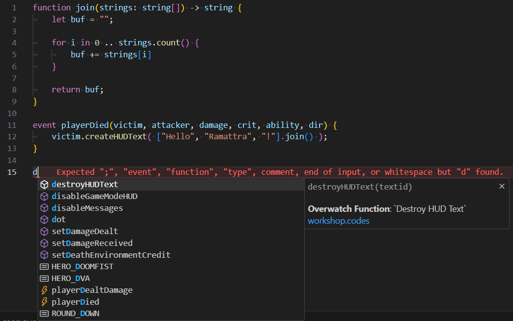

# Ramattra  

A language similar to Typescript that compiles to [Overwatch Workshop Scripts](https://workshop.codes/wiki).

## Features
- [x] Language Server
- [x] [Online Playground](https://dvvcz.github.io/Ramattra)
- [x] CLI

## Example

## Wiki

You can find information about the language [on the wiki](https://github.com/DvvCz/Ramattra/wiki).